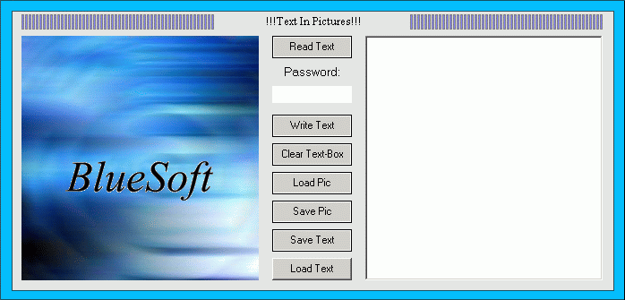



## Text in Pictures

### Description

This Code will show you how to Encrypt text in Images. Very Useful if you want to send a secret message to someone. Feedback is most welcomed.
 
### More Info
 

             |
---                |---
**Submitted On**   |2003-10-01 21:32:48
**By**             |[Keral\.C\.Patel\.](https://github.com/Planet-Source-Code/PSCIndex/blob/master/ByAuthor/keral-c-patel.md)
**Level**          |Beginner
**User Rating**    |4.3 (13 globes from 3 users)
**Compatibility**  |VB 6\.0
**Category**       |[Complete Applications](https://github.com/Planet-Source-Code/PSCIndex/blob/master/ByCategory/complete-applications__1-27.md)
**World**          |[Visual Basic](https://github.com/Planet-Source-Code/PSCIndex/blob/master/ByWorld/visual-basic.md)
**Archive File**   |[Text\_in\_Pi1652921022003\.zip](https://github.com/Planet-Source-Code/keral-c-patel-text-in-pictures__1-48951/archive/master.zip)

